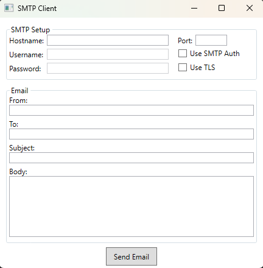

<br/>
<div align="center">
<a href="https://github.com/ShaanCoding/ReadME-Generator">

</a>
<h3 align="center">SMTP client</h3>
<p align="center">
Simple GUI utility to send emails via SMTP server

<br/>
<br/>
  
<a href="https://github.com/xNOTHlNGx/SMTP-client/issues/new?labels=bug&template=bug-report---.md">Report Bug</a>

</p>
</div>

## About The Project



This is simple script written in dotnet (C#) with WPF (Windows-only user interface framework)
### Prerequisites

To run or build this project, you need to install some prerequisites. For most situations, just look at the [Official Microsoft Installation Guide](https://learn.microsoft.com/en-us/dotnet/core/install/). This is the most appropriate guide for most users. However, if you want to install dotnet using the CLI tools, you can use these simple commands:

- Windows
  ```sh
  winget install Microsoft.DotNet.SDK.8
  winget install Microsoft.DotNet.DesktopRuntime.8
  winget install Microsoft.DotNet.AspNetCore.8
  ```
- Linux 
  ```sh
  wget https://dot.net/v1/dotnet-install.sh -O dotnet-install.sh
  chmod +x ./dotnet-install.sh
  ./dotnet-install.sh --version latest --runtime aspnetcore
  ```
### Installation

Here are simple instructions for building the dotnet code with CLI tools.

1. Install dotnet and runtime
2. Clone the repo
   ```sh
   git clone https://github.com/xNOTHlNGx/SMTP-client.git
   ```
3. Go into project folder and build script
   ```sh
   cd SMTP-client
   dotnet build -r win-x64 -p:PublishSingleFile=true --self-contained false
   ```
## License

Distributed under the GPL License. See [GPL License](https://www.gnu.org/licenses/gpl-3.0.html) for more information.

## Contact

- Telegram: [@xNOTHlNGx](https://t.me/xNOTHlNGx) 
- Email: [not_a_nothing@proton.me](mailto:not_a_nothing@proton.me)

Project Link: [https://github.com/xNOTHlNGx/SMTP-client](https://github.com/xNOTHlNGx/SMTP-client)
